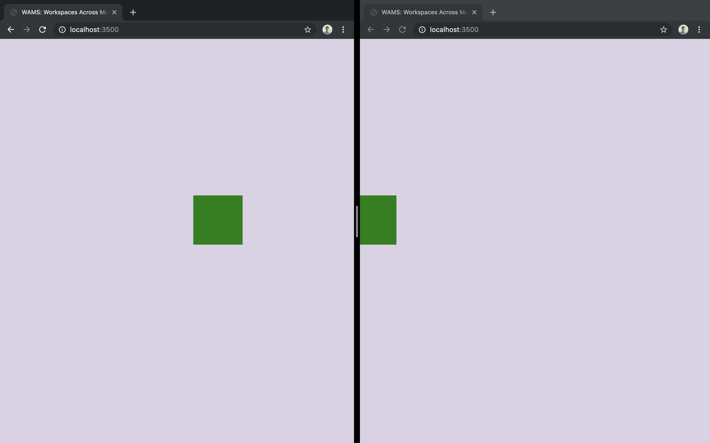

# WAMS: Workspaces Across Multiple Surfaces

[](https://codeclimate.com/github/hcilab/wams/maintainability)

WAMS is a Web API that makes creating Multi-Screen applications easy. Multi-screen applications are ones where multiple devices (and their screens) can be used together in flexible ways allowing objects to be easily moved between screens or interactions, like gestures, to span multiple screens.

WAMS abstracts away connection code, client and server architecture and related technology, to provide a simple, unified framework that allows focus to be placed on creating and defining new interactions rather than on pre-requisite communication code.

We use browser windows to represent screens because browsers are extremely flexible - they are cross-platform, already available on multiple devices and can fill screens (or be used to subdivide screens).

## Contents

- [Installation](#installation)
- [Getting started](#getting-started)
- [Examples](#examples)
- [Live Demo](#live-demo)
- [Walkthrough](#walkthrough)
  - [Set up your application](#set-up-your-application)
  - [Hello world](#hello-world)
  - [Hello world: Multi-Screen](#hello-world-multi-screen)
  - [General Configuration](#general-configuration-of-your-app)
  - [Basics](#basics)
  - [Polygons](#polygons)
  - [Images](#images)
  - [HTML](#html)
  - [Scale and Rotation](#scale-and-rotation)
  - [Interactivity](#interactivity)
  - [Static resources](#static-resources)
  - [Connections](#connections)
  - [Multi-Screen Layouts](#multi-screen-layouts)
  - [Advanced](#advanced)
    - [Custom items](#custom-items)
    - [Custom events](#custom-events)
    - [Interaction rights](#interaction-rights)
    - [Grouped items](#grouped-items)

## Installation

You will need to install [node.js and npm](https://docs.npmjs.com/downloading-and-installing-node-js-and-npm).

Then you can install this repo directly as a node module. For example, to install the stable `hello-world-test` release:
```bash
npm install hcilab/wams#hello-world-test
```

## Getting started

The easiest way to get started is to follow the [Walkthrough](#walkthrough) tutorial below. More advanced users might want to check the [code documentation](https://hcilab.github.io/wams/) and the [examples](#examples). ~For a taste on how WAMS works, check the [live demo section](#live-demo).~ (The live demo is currently broken).

## Examples

To try out the examples, go to `examples/` and run as follows:

```bash
node examples/[EXAMPLE_FILENAME]
```

## For example:

```bash
node examples/polygons.js
```

## Live Demo

* (Currently broken)

The [live demo](https://wams-player-demo.herokuapp.com/) is an example of a video-player with a distributed user interface. First, the player controls are displayed on the screen with the video. Go to the url with a second device or browser, and as a second view is connected, the controls are automatically moved to that view.

To check out the code of the live demo, see `examples/video-player.js`

## Walkthrough

This walkthrough is a friendly guide on how to use most WAMS features. For more details, see [code documentation](https://hcilab.github.io/wams/).

> **Note** The examples on this page use ES2015 (ES6) JavaScript syntax like `const` variables and object destructuring. If you are not familiar with ES2015 features, you can [read](https://webapplog.com/es6/) about them first.

### Set up your application

First, let's set up a new directory for our demo application, and install WAMS into it:

```bash
mkdir demo
cd demo
npm install hcilab/wams#hello-world-test
```

Now, create an **app.js** file. In this file, include WAMS and initialize the application:

```javascript
const WAMS = require("wams");
const app = new WAMS.Application();
app.listen(3500); // this starts the app on port 3500, you can use any port
```

Now, you can run your first WAMS application by executing:

```bash
node app.js
```

And you can connect to the app using the address in the output.
- Many terminal emulators let you control+click on an address to visit it in your browser.

### Hello world

Let's now make your first WAMS app do something. Add the following code just before the last line:

```javascript
// the line below is equivalent to `const square = WAMS.predefined.items.square;`
const { square } = WAMS.predefined.items;

// spawn a square on the screen
app.spawn(square(200, 200, 100, "green"));
```

This code creates a green square on the canvas with coordinates `{ x: 200, y: 200 }` and a length of `100`.

### Hello world: Multi-Screen

Here is a simple example to show how several screens work with WAMS.

This example will spawn a draggable square and position connected screens in a line.

Put this code in your **app.js** file:

```javascript
const WAMS = require("wams");
const app = new WAMS.Application();

const { actions, items, layouts } = WAMS.predefined;

function spawnSquare() {
  const greenSquare = app.spawn(items.square(200, 200, 100, "green"));
  greenSquare.on('drag', actions.drag);
}

const line = new layouts.Line(300); // 300px overlap betweens views

function handleConnect({ view, device }) {
  view.on('click', spawnSquare);
  line.layout(view, device);
}

app.on('connect', handleConnect);

app.listen(3500);
```

_Don't worry if the code doesn't make sense to you yet. The walkthrough will explain all the features used in it._

The square can now be moved around and seen by multiple screens with less than 20 lines of code 🎉

To test this on a single computer you could:

- open one browser window covering half your screen and position it on the left
- open another browser to the same address and position it on the right
- now click on an empty area to create a square
- click and hold to drag the square towards the other browser window
- you have your first multiscreen app!



> To try a more complex multi-screen gestures example (gestures that span multiple screens), check out `examples/shared-polygons.js`. (Currently broken).

### General Configuration of your app

The application can be configured through some options.

Below is the full list of possible options with example values.

```javascript
const router = WAMS.predefined.routing.router();
const staticDir = path.join(__dirname, "static");  // path to directory for static files, will be accessible at app's root
WAMS.predefined.routing.addStaticDirectory(router, staticDir);
const app = new WAMS.Application(
  {
    backgroundImage: "./monaLisa", // background image of the app
    color: "white", // background color of the app
    clientLimit: 2, // maximum number of devices that can connect to the app
    clientScripts: ["script.js"], // javascript scripts (relative paths or URLs) to include by the browser
    stylesheets: ["styles.css"], // css styles to include by the browser
    shadows: true, // show shadows of other devices
    status: true, // show information on current view, useful for debugging
    title: "Awesome App", // page title
    useMultiScreenGestures: true, // enable multi-screen gestures (currently broken)
  },
  router
);
```

You can substitute `const app = new Wams.Application();` in your code with the code above to play with different options.

### Basics

A WAMS app is made of **items**. There are several predefined items (see in the [code documentation](https://hcilab.github.io/wams/module-predefined.items.html)):

- `rectangle`
- `square`
- `polygon`
- `image`
- `html`

Most of the items (except `html`) are used on HTML **canvas**, which is the core of WAMS (i.e., in WAMS everything is drawn on HTML canvas, although for the most part, you do not need to know about this).

You have already seen `square` used in the Hello world example above. Now let's look at some other items.

### Polygons

```javascript
// application setup omitted here
// and in following examples

const { polygon } = WAMS.predefined.items;

const points = [
  { x: 0, y: 0 },
  { x: 50, y: 0 },
  { x: 25, y: 50 },
];

app.spawn(
  polygon(points, "green", {
    x: 500,
    y: 100,
  })
);
```

Polygons are built using an array of relative points. For a random set of points, you can use `randomPoints` method from `Wams.predefined.utilities` (see in [code documentation](https://hcilab.github.io/wams/module-predefined.utilities.html#.randomPoints)).

For example:

```javascript
const { randomPoints } = WAMS.predefined.utilities;
const { polygon } = WAMS.predefined.items;

const points = randomPoints(4);

app.spawn(
  polygon(points, "green", {
    x: 500,
    y: 100,
  })
);
```

### Images

To use images, you first need to set up a path to the [static directory](#static-resources).

For this example, create an `images` directory in the app folder and use it as your static directory.

Put `monaLisa.jpg` from `examples/img` to the images folder.

```javascript
const path = require("node:path");
const router = WAMS.predefined.routing.router();
const staticDir = path.join(__dirname, "images");
WAMS.predefined.routing.addStaticDirectory(router, staticDir);
const app = WAMS.Application({}, router);

const { image } = WAMS.predefined.items;
app.spawn(
  image("monaLisa.jpg", {
    width: 200,
    height: 350,
    x: 300,
    y: 300,
  })
);
```

Make sure to include **width** and **height**.

> **Example** To see a great example of using images, check out `examples/card-table.js`

### HTML

If you need more control over styling than a canvas provides, or you would like to use `iframe`, `audio`, `video` or other browser elements, WAMS also supports spawning **HTML** items.

```javascript
const { html } = WAMS.predefined.items;

app.spawn(
  html("<h1>Hello world!</h1>", 200, 100, {
    x: 300,
    y: 100,
  })
);
```

The code above will spawn a wrapped `h1` element with width of `200` and height of `100`, positioned at `{ x: 300, y: 100 }`.

### Scale and Rotation

You can set initial scale and rotation of an item:

```javascript
app.spawn(
  polygon(points, "green", {
    x: 500,
    y: 100,
    scale: 2,
    rotation: Math.PI,
  })
);
```

> **Note** Rotation is done around the top left corner and is defined in radians (Pi = 180 deg)

### Interactivity

> **Note** An item must have its coordinates, width and height defined to be interactive

To make an item **draggable**, it's enough to attach the predefined drag action to the drag event:

```javascript
const item = app.spawn(items.square(200, 200, 100, 'green'));
item.on('drag', actions.drag);
```

This looks much better. Now let's remove the square when you **click** on it. _To remove an item, use WAMS' `removeItem` method._

```js
item.on('click', () => app.removeItem(item));
```

Another cool interactive feature is **rotation**. To rotate an item, first add a `rotate` listener, (the predefined action will do the trick), and then grab the item with your mouse and hold **Control** key.

```js
item.on('rotate', actions.rotate);
```

You can also listen to **swipe** events on items (hold the item, quickly move it and release). To do that, add a `swipe` handler.

```js
function handleSwipe(event) {
  console.log(`Swipe registered!`);
  console.log(`Velocity: ${event.velocity}`);
  console.log(`Direction: ${event.direction}`);
  console.log(`X, Y: ${event.x}, ${event.y}`);
}
item.on('swipe', handleSwipe);
```

To move an item, you can use `moveBy` and `moveTo` item methods:

```js
// do this on a different item than the one that uses removeItem
item.on('click', () => item.moveBy(100, -50));
```

Both methods accept `x` and `y` numbers that represent a vector (for `moveBy`) or the final position (for `moveTo`).

_You can add event handlers to all WAMS items._

### Static resources

Often times, you want to use images, run custom code in the browser, or add CSS stylesheets.

To do that, first **set up a path to the static directory:**

```javascript
const path = require("node:path");
const { router, addStaticDirectory } = WAMS.predefined.routing;

// We'll need to use our own router in order to add custom static routes. This
// could be an Express app, or we could use the one provided by the WAMS
// routing module.
const router = router();
addStaticDirectory(router, path.join(__dirname, "assets"));
const app = new WAMS.Application({}, router);
```

The `router` provided by WAMS is an Express app that comes with routes set up to deliver a basic predefined HTML page and the javascript needed to run WAMS in a client browser.

This makes files under the specified path available at the root URL of the application. For example, if you have the same configuration as above, and there is an `image.png` file in the `assets` folder, it will be available at `http(s)://<app-url>/image.png`

- To run code in the browsers that use your app, create a **.js** file in your app _static directory_ and include it in the application config:

```javascript
const app = new WAMS.Application(
  {
    clientScripts: ["js/awesome-script.js"],
  },
  router
);
```

The scripts will be automatically loaded by the browsers.

- To add CSS stylesheets:

```javascript
const app = new WAMS.Application(
  {
    stylesheets: ["css/amazing-styles.css"],
  },
  router
);
```

The stylesheets will be automatically loaded by the browsers.

### Connections

WAMS manages all connections under the hood, and provides helpful ways to react on **connection-related events**:

- `connect` – emitted each time a screen connects to a WAMS application
- `disconnect` – emitted when a screen disconnects

You can listen for both events on the Application instance. The handler function gets an event object with these properties:

1. `view`
2. `device`
3. `group`

**`View`** is an object that stores the **state** of the connected screen, including:

- `index`
- `topLeft`, `topRight`, `bottomRight` and `bottomLeft` positions
- `scale`
- `rotation`
- `width`
- `height`

It also provides **methods** to transform the current screen's view:

- `moveBy`
- `moveTo`
- `rotateBy`
- `scaleBy`

And you can set up **event listeners** for the view itself, such as:

- `drag`
- `rotate`
- `pinch`
- `click`

**`Device`** stores dimensions of the screen and its original position when connected.

**`Group`** is a group of views and should be used instead of **View** _when multi-screen gestures are enabled_. (Multi-screen gestures are currently broken).

### Multi-Screen Layouts

By default, every connected screen is positioned in the same location and can see the same objects. However, you can build more complex layouts by using `view`, `device` and `group` objects' methods and state, or use one of the out-of-box predefined layouts.

There are currently two predefined layouts: `table` and `line`.

**`Table`**

Places users around a table, with the given amount of overlap. The first user will be the "table", and their position when they join is stamped as the outline of the table. The next four users are positioned, facing inwards, around the four sides of the table.

```js
const { table } = WAMS.predefined.layouts;

const overlap = 200; // 200px overlap between screens
const setTableLayout = table(overlap);

function handleConnect({ view, device }) {  // note the {} brackets to destructure the event object
  setTableLayout(view, device);
}

app.on('connect', handleConnect);
```

To see this layout in action, check out the `card-table.js` example.

**`Line`**

Places users in a line, with the given amount of overlap. Best used with either multi-screen gestures or when users are unable to manipulate their views.

```js
// application config should include
// "useMultiScreenGestures: true"

const { Line } = WAMS.predefined.layouts;

const overlap = 200; // 200px overlap between screens
const line = new Line(overlap);

function handleConnect({ view, device }) {  // note the {} brackets to destructure the event object
  line.layout(view, device);
}

app.on('connect', handleConnect);
```

To see this layout in action with multi-screen gestures, check out the `shared-polygons.js` example.

## Advanced

When building more complex applications, sometimes you might want to have more flexibility than predefined items and behaviors provide.

The following sections show how to go beyond that.

### Custom items

To spawn a custom item, use `CanvasSequence`. It allows to create a custom sequence of canvas actions and you can use most of the HTML Canvas methods as if you are writing regular canvas code.

The following sequence draws a smiling face item:

```js
function smileFace(args) {
  const sequence = new WAMS.CanvasSequence();

  sequence.beginPath();
  sequence.arc(75, 75, 50, 0, Math.PI * 2, true); // Outer circle
  sequence.moveTo(110, 75);
  sequence.arc(75, 75, 35, 0, Math.PI, false); // Mouth (clockwise)
  sequence.moveTo(65, 65);
  sequence.arc(60, 65, 5, 0, Math.PI * 2, true); // Left eye
  sequence.moveTo(95, 65);
  sequence.arc(90, 65, 5, 0, Math.PI * 2, true); // Right eye
  sequence.stroke();

  return { ...args, sequence };
}

app.spawn(smileFace({ x: 400, y: 300 }));
```

You can add interactivity to a custom item the same way as with predefined items. However, you first need to add a _hitbox_ to the item. This can be a bit confusing, since the hitbox will always be given (x, y) values as if its item is located a (0, 0). Put another way, the hitbox doesn't need to know anything about how the item is positioned or oriented in the WAMS workspace:

```javascript
function interactableSmileFace(args) {
  const hitbox = new WAMS.Circle(
    50,  // 50 is the radius of the outer circle of the smiley
    75,  // the smiley is centered at (75, 75)
    75,
  );
  return smileFace({ ...args, hitbox });
}

// The Circle doesn't need to know that we're creating the smiley at (900, 300) in the workspace
const item = app.spawn(interactableSmileFace({ x: 400, y: 200 }));
item.on('drag', actions.drag);
```

A hitbox can be made from `WAMS.Rectangle` or `WAMS.Polygon2D` or `WAMS.Circle`

`WAMS.Polygon2D` accepts an array of points – vertices of the resulting polygon.

### Custom events

Sometimes, you would like to tell devices to execute client-side code at a specific time. Or you would like to communicate some client-side event to the server. To allow that, WAMS provides **custom events**.

##### From Client to Server

Let's say we would like to send a message from the client to the server. WAMS methods are exposed to the client via the global `WAMS` object.

To **dispatch a server event**, use `WAMS.dispatch()` method:

```javascript
// client.js

WAMS.dispatch("my-message", { foo: "bar" });
```

This dispatches a custom event to the server called `my-message` and sends a payload object.

To **listen to this event on the server**, use `app.on()` method:

```javascript
// app.js

app.on("my-message", handleMyMessage);

function handleMyMessage(data) {
  console.log(data.foo); // logs 'bar' to the server terminal
}
```

##### From Server to Client

To **dispatch a client event** from the server, use `app.dispatch()` method.

```javascript
// app.js

app.dispatch("my-other-message", { bar: "foo" });
```

To **listen to this event on the client**, use `WAMS.on()` method:

```javascript
// client.js

WAMS.on("my-other-message", handleMyOtherMessage);

function handleMyOtherMessage(data) {
  console.log(data.bar); // logs 'foo' to the browser console
}
```

_Under the hood_, client-side events are implemented with the DOM's [CustomEvent](https://developer.mozilla.org/en-US/docs/Web/API/CustomEvent/CustomEvent). If you want to trigger a WAMS client event _on the client_, you can dispatch a custom event on the document element.

### Interaction rights

To give different views different rights for interacting with items, use `view.index` to differentiate between connected devices.

> A view is assigned the lowest free `index`, starting with 0. When a view with lower index disconnects, other connected views' indices stay the same.

For example, let's say we are making a card game and would like to only allow a card owner to flip it.

To do that, first we'll add an index to the card item to show who its owner is.

```javascript
// during creation
const card = app.spawn(
  image(url, {
    /* ... */
    owner: 1,
  })
);

// or later
card.owner = 1;
```

The `owner` property does not have a special meaning. You can use any property of any type.

Now, we will only flip the card if the event comes from the card owner:

```javascript
function flipCard(event) {
  if (event.view.index !== event.target.owner) return;

  const card = event.target;
  // assume we've attach 'back' and 'face' properties to the card with paths to images
  const imgsrc = card.isFaceUp ? card.back : card.face;
  card.setImage(imgsrc);
  card.isFaceUp = !card.isFaceUp;
}
```

### Grouped items

Sometimes you would like to spawn several items and then move or drag them together. To do that easily, you can use the `createGroup` method (see in the [code documentation](https://hcilab.github.io/wams/module-server.Application.html#createGroup)):

```javascript
const items = [];

items.push(
  app.spawn(
    html("<h1>hello world</h1>", 300, 100, {
      x: 300,
      y: 300,
    })
  )
);

items.push(app.spawn(square(100, 100, 200, "yellow")));

items.push(app.spawn(square(150, 150, 200, "blue")));

const group = app.createGroup({ items });
group.on('drag', actions.drag);

group.moveTo(500, 300);
```

Groups can only be moved together- rotation and scaling are not supported.

---

# Contribution

We welcome contribution to WAMS, please find details on how to setup your local development environment.

## Setup

WAMS is a Node.js projects, and with that requires that you have Node installed. We recommend using [ASDF](https://asdf-vm.com/) or [NVM](https://github.com/nvm-sh/nvm) as your Node Version Manager to install the correct version of Node.

**Step #1:** Install Node.js

```bash
# Using ASDF
asdf current # This will list the version of Node for this project
asdf install nodejs <version> # Install the correct version of Node

# Using NVM
nvm install
```

**Step #2:** Install dependencies

```bash
npm install
```

<!-- **Step #3:** Build the project -->
<!-- TODO: Figure out how to build or test the project -->

## Workflow

### Linting

The package.json file include a `lint` script that will run the linter via the CLI via

```bash
npm run lint
```

To fix linting errors, run

```bash
npm run lint:fix
```

#### Automatic Linting/Format On Save

To enable automatic linting and saving on save, you can download the [ESLint](https://marketplace.visualstudio.com/items?itemName=dbaeumer.vscode-eslint) VS Code extension. All other required settings are included in the `.vscode/settings.json` file.
