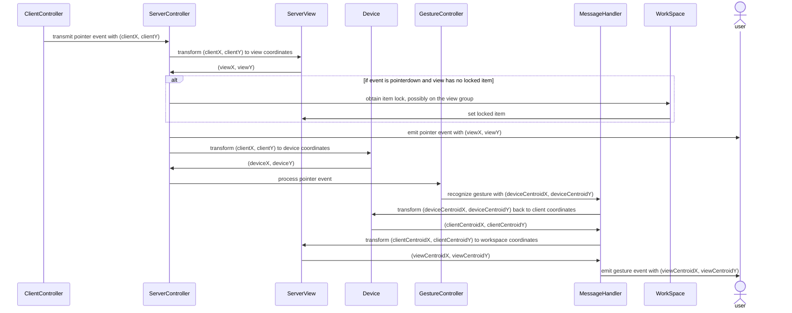

```mermaid
sequenceDiagram
    participant cc as ClientController
    participant sc as ServerController
    participant sv as ServerView
    participant dv as Device
    participant gc as GestureController
    participant mh as MessageHandler
    participant ws as WorkSpace
    actor user

    cc ->> sc : transmit pointer event with (clientX, clientY)
    sc ->> sv : transform (clientX, clientY) to view coordinates
    sv ->> sc : (viewX, viewY)
    alt if event is pointerdown and view has no locked item
        sc ->> ws : obtain item lock, possibly on the view group
        ws ->> sv : set locked item
    end
    sc ->> user : emit pointer event with (viewX, viewY)
    sc ->> dv : transform (clientX, clientY) to device coordinates
    dv ->> sc : (deviceX, deviceY)
    sc ->> gc : process pointer event
    gc ->> mh : recognize gesture with (deviceCentroidX, deviceCentroidY)
    mh ->> dv : transform (deviceCentroidX, deviceCentroidY) back to client coordinates
    dv ->> mh : (clientCentroidX, clientCentroidY)
    mh ->> sv : transform (clientCentroidX, clientCentroidY) to workspace coordinates
    sv ->> mh : (viewCentroidX, viewCentroidY)
    mh ->> user : emit gesture event with (viewCentroidX, viewCentroidY)
```
