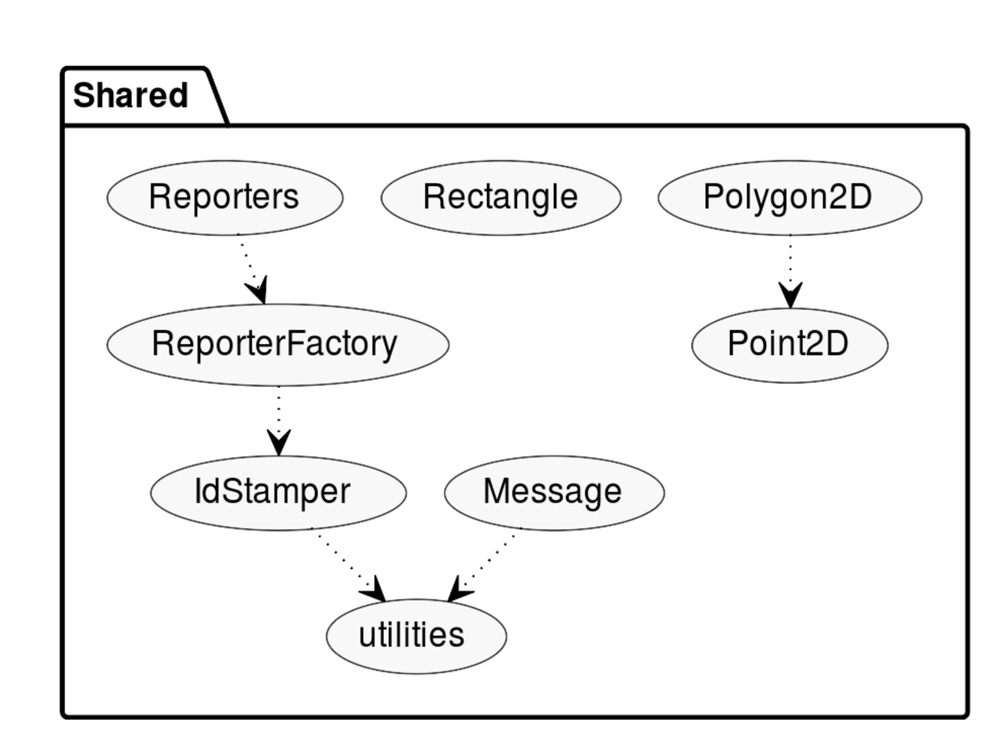
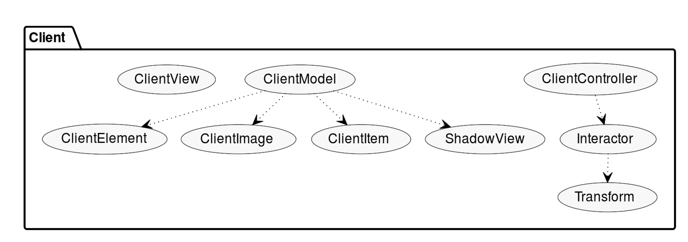
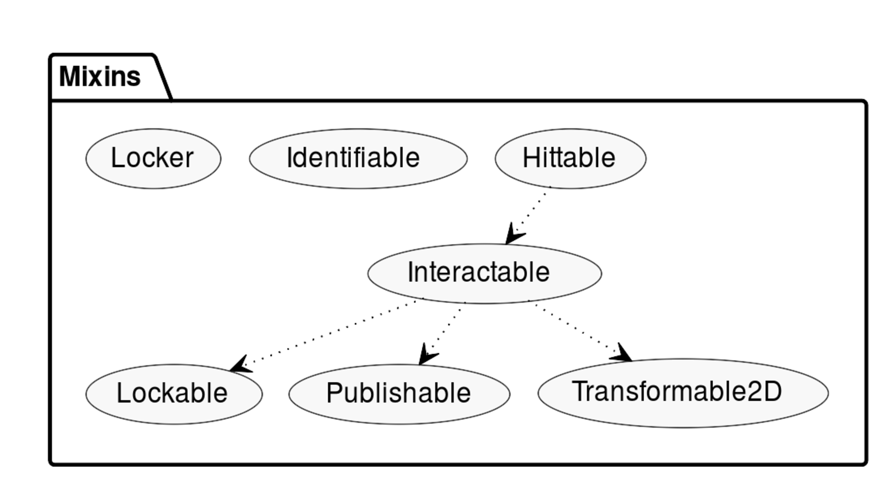
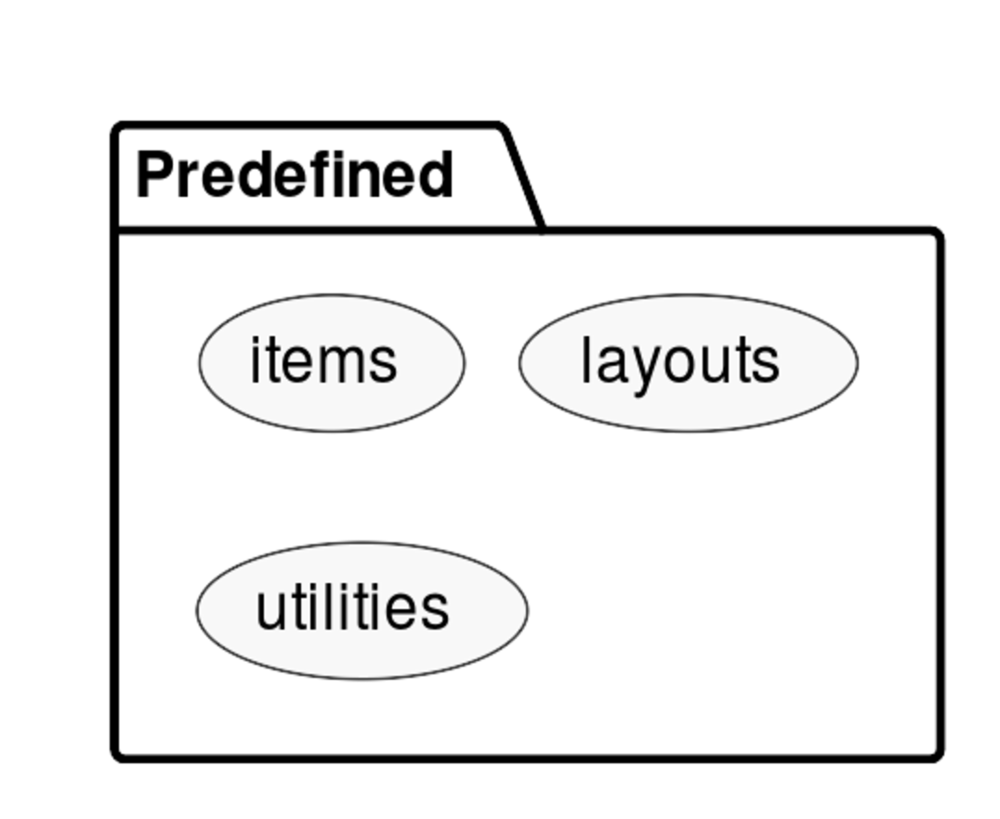

\clearpage

# Outline

* [Introduction]
* [Architecture]
* [Evaluation]
* [Deliverables]
* [References]

\clearpage

# Introduction

Interactive surfaces, be they smartphones, tablets, traditional desktops,
smartwatches, or other innovative surfaces have become increasingly ubiquitous.
A Multi-Display Environment (MDE) aims to coordinate these devices into a single
shared workspace. Such environments are useful, opening up possible applications
ranging from multiplayer games to assisting hospitalized
children.[^hospitalized] Development of such environments is difficult, however,
owing to challenges relating to design, technical capabilities, and social
aspects.[^challenge1] This project presents Workspaces Across Multiple Surfaces
(WAMS), which aims to reduce the technical difficulty of creating multi-display
applications by providing an API for web-based MDEs.

The technical challenges encountered in the development of an MDE include:

1. Deployment of a server.
2. Connection establishment and maintenance.
3. Representation of connected devices within the workspace.
4. Alignment of the workspace for each device such that the workspace can be
   accurately rendered.
5. Maintenance of a model of workspace objects.
6. Rendering of workspace objects.
7. Coordination between devices during interaction. This includes
   synchronization and the locking of objects while they being interacted with.
8. Ensuring that the system is responsive to user interaction.

These general challenges must be overcome in order for an MDE application to be
successfully written, and it is these challenges that WAMS aims to address.

Additionally, the use of multiple devices raises the possibility of taking
traditional multitouch gestures such as pinching or rotating and applying them
across multiple devices. That is, combining pointers moving on the surface of
different devices into a single coordinated multitouch gesture. WAMS provides an
experimental implementation of such gestures that is accessible via the API.

Throughout this document, the phrase "the programmer" is used to refer to a
programmer making use of the WAMS API.

[^challenge1]: Grubert, Jens, Matthias Kranz, and Aaron Quigley. "Challenges in
Mobile Multi-Device Ecosystems." ArXiv.org 5, no. 1 (2016): 1-22.

[^hospitalized]: Garcia-Sanjuan, Fernando, Javier Jaen, and Alejandro Catala.
"Multi-Display Environments to Foster Emotional Intelligence in Hospitalized
Children." Proceedings of the XVI International Conference on Human Computer
Interaction 07-09 (2015): 1-2.

\clearpage

# Architecture

This section of the document details the architecture design of the WAMS
project. It covers fundamental architectural design decisions, the purpose of
each of the modules, and briefly discusses each of the classes. For more
in-depth information about any particular class, method, or chunk of code, see
the [documentation](https://mvanderkamp.github.io/wams/).[^mydocs]

[^mydocs]: <https://mvanderkamp.github.io/wams/>

---

## Contents

* [Basic Design]
* [Core Concepts]
    - [Coordination]
    - [Message / Reporter Protocol]
    - [Unique Identification]
    - [Mixin Pattern]
    - [Model-View-Controller]
    - [Smooth and Responsive Interaction]
* [Runtime Dependencies]
* [Build Tools]
* [Testing]
* Modules
    - [Shared]
    - [Client]
    - [Server]
    - [Mixins]
    - [Gestures]
    - [Predefined]
* [Connection Establishment]

\clearpage

## Basic Design

There have been numerous other projects exploring the concept of Multi-Device
Environments. Some of them, such as Conductor, have each device running discrete
tasks, with the system controlling communication and synchronization between
them.[^conductor] Others used a series of large displays to create digital
rooms.[^rooms] The approach taken with WAMS is to leverage the technology of
the web, allowing any device capable of running a modern browser to connect to a
WAMS application, and to allow the programmer to control the digital layout of
the devices as they connect to a single, shared workspace.

The project is written in JavaScript and powered by `node.js`. WAMS applications
are run from the command line on a computer that acts as the server. Clients, on
the same local network as the server, use a browser to connect to the IP address
of the server. The [connection establishment](#connection-establishment) process
hooks up the client, and they can begin interacting with the application.

Generally, all programmer code will only be run on the server, as the bundle of
JavaScript, HTML, and CSS that is delivered to clients is static and is not
exposed by the API. This allows programmers to forego concerns such as bundling
and transpiling that otherwise crop up when delivering JavaScript code to
browsers.  There are some limitations to this technique, but a workaround may
exist through the use of HTML elements as workspace items, which could include
`<script>` tags. This feature has yet to be tested though.

Primarily, WAMS applications are rendered in immediate mode on an HTML5 canvas
that fills the client's browser viewport. Objects in the shared workspace are,
for the most part, rendered by sequences of canvas context instructions that are
defined and delivered using the `canvas-sequencer` package. It is also possible
to load and render images onto the canvas. As mentioned above, an experimental
feature that has not yet been fully developed allows the use of arbitrary HTML
elements as part of a WAMS application. These sit on top of the canvas and
operate in the retained mode graphics context of normal webpages, while still
being consistently presented across devices, with appropriate transformations in
the same vein as the canvas rendered objects.

[^conductor]: Hamilton, Peter, and Daniel Wigdor. "Conductor: Enabling and
  Understanding Cross-device Interaction." Proceedings of the SIGCHI Conference
  on Human Factors in Computing Systems, 2014, 2773-782.

[^rooms]: Johanson, B., A. Fox, and T. Winograd. "The Interactive Workspaces
  Project: Experiences with Ubiquitous Computing Rooms." IEEE Pervasive
  Computing 1, no. 2 (2002): 67-74.

\clearpage

## Core Concepts

* [Coordination]
* [Message / Reporter Protocol]
* [Unique Identification]
* [Mixin Pattern]
* [Model-View-Controller]
* [Smooth and Responsive Interaction]

---

### Coordination

Proper synchronization and object locking is critical to the successful
operation of a WAMS application. These activities are achieved by taking
advantage of the single-threaded nature of `node.js`. The client code is
completely independent of any synchronization and locking tasks, instead simply
forwarding user interaction events to the server and maintaining an up-to-date
renderable model of the application. This approach ensures that all user
interactions are funnelled through a single thread on the server, vastly
simplifying coordination tasks.

Locking and unlocking is handled by the `Locker` and `Lockable` mixins.  When a
user begins interacting with the system, the server controller performs hit
detection, looking for a free item at the centroid of the first contact points.
If such an item is found, it is locked to the client. No other client can
interact with the item while this lock is held. The lock is released when the
client has removed all pointers from the interactive surface. In the case of
multi-device gestures, a single lock is shared by all clients belonging to a
`ServerViewGroup`. If hit detection fails to locate a free item, the client
instead locks onto their own view.

The successful operation of this approach is contingent on the single-threaded
nature of JavaScript and `node.js` to ensure that race conditions do not occur
for the locks.

---

### Message / Reporter protocol

One of the early challenges encountered was to ensure that only the correct
data is transferred over the network, and that when a message is received
through a socket, it would have the expected data. The `Message / Reporter`
protocol was developed to solve this issue, providing a funnel through which to
pass all data.

The first step was to ensure that only the correct data gets transmitted. This
is where the `ReporterFactory` comes in. By calling this factory with an object
consisting of key-value pairs describing a set of core properties and their
default values, the factory will return a class which extends the `Reporter`
class. An instance object of this class has a method, `report()`, which returns
an object consisting _only_ of the core properties and their current values.
This ensures that even though arbitrary additional properties may exist on the
object (either through further class extensions or direct additions by a user)
only the core properties will be sent if whatever routine sends the data calls
this `report()` method.

Also available on all `Reporter` classes is an `assign(data)` method. All
properties immediately on the data object will be assigned to the `Reporter`
instance, allowing arbitrary data to be stored. A deeper search is done for the
core properties of the `Reporter` instance, checking the entire prototype chain
of the `data` object. For information on the prototype chain, see Kyle
Simpson's book series, [You Don't Know JavaScript[^ydkjs]](
https://github.com/getify/You-Dont-Know-JS).

[^ydkjs]: See <https://github.com/getify/You-Dont-Know-JS>.

The second step was to create a `Message` class with a static list of acceptable
message types. A `Message` is constructed with one of these message types and an
instance of a `Reporter`. It can then emit a `report()` of the instance.

If this protocol is followed strictly then only the critical pieces of data will
get transmitted, and they will be associated with the expected `Message` type
when they get there. This requires discipline- it is obviously still possible to
directly `emit` messages over socket connections. Of course, programmer
discipline is also required to make sure that the `Message` type selected is
appropriate for the occasion and associated `Reporter` instance, though it may
be possible to enforce this restriction if this proves difficult.

There is a work-around for cases where lots of different types of little pieces
of data need to be transmitted. See the `DataReporter` class in the
documentation.

---

### Unique Identification

In a large system like this, where it is important to keep track of and uniquely
identify lots of different kinds of objects correctly on both the client and the
server, it is very useful to centralize the identification technique. This is
where the `IdStamper` class comes in. It provides a common structure by which
unique IDs can be assigned and copied. Each `IdStamper` instance will only
generate each numerical ID once, so the scope of the uniqueness of IDs is
determined by the scope of the `IdStamper` instance.

---

### Mixin Pattern

The complexity of the code, particularly on the server, would be significantly
higher were it not for the mixin pattern. The short and simple version for those
more accustomed to software engineering with Java is that a mixin is an
interface whose methods are already implemented.

More precisely, a mixin "mixes" functionality into an already existing class to
form a new subclass. This allows the programmer to bundle related pieces of
functionality together into a mixin, and then attach those bundles to classes as
they see fit.

This pattern fits neatly on top of the `Message` / `Reporter` protocol. This
protocol requires that `Views` and `Items` and their related classes need to be
distinct, yet functionally these two distinct types of classes ultimately need
to perform a lot of similar actions. Mixins solves this problem beautifully,
making the whole system more succinct and easier to maintain in the
process.[^mixins]

[^mixins]: A more in-depth discussion of mixins and the inspiration for the
specific implementation approach used can be found at
<http://justinfagnani.com/2015/12/21/real-mixins-with-javascript-classes/>.

---

### Model-View-Controller

Both the client and the server implement their own version of the MVC pattern,
ultimately operating together as a larger MVC pattern.

#### _Client MVC_

The client side version is the most straightforward, and looks a lot like
classical MVC. The catch of course is that the `ClientController` sends user
events to the server, and only interacts with the model or view when it receives
instructions from the server. The other catch is that, as the only thing objects
in the model need to do is draw themselves, they each implement a `draw()`
method for the `ClientView` to use.

#### _Server MVC_

The server side is more complicated. The most obvious reason for this is that,
being an API, programmers need to be able to attach their own controller code.
The one big simplification is that there's no view, as nothing needs to be
rendered.

The approach taken is to split the model in two. One of these is the
`WorkSpace`, which holds all the actual objects in the model that will need to
be rendered. Specifically, these are the objects which are explicitly spawned
into the model by the programmer. 

The other is the `ServerViewGroup`, which holds the server's representations of
the client's views (that is, what the clients can see). The programmer does not
have control over spawning and removing the views, they are spawned when a user
connects and removed when a user disconnects.

The `ServerController` instances are spawned and maintained by the
`Switchboard`, and these controllers maintain a link to their associated
`ServerView` and its physical `Device`.

One other wrinkle is that, in order to support multi-device gestures, the
`ServerViewGroup` has a single `GestureController` which is responsible only for
maintaining the state of active pointers and calculating whether gestures have
occurred. It does this by hooking up the gesture classes provided by the
`westures` package with the custom gesture engine found in the `gestures`
module of this project. Storing the gesture controller in the view group opens
up the possibility of creating multiple groups of devices, with each group
capable of recognizing its own multi-device gestures, although this extension is
not yet implemented.

Regardless of whether the gestures are processed by a client or on the server,
either the `ServerController` or the `GestureController` will ultimately funnel
the event through the `MessageHandler`, which calls any listeners the programmer
has attached, as appropriate.

#### _Client and Server MVC Together_

Taken together, the client and the server form a larger MVC pattern, with the
client representing the view and part of the controller, and the server
representing the other part of the controller as well as the model.

---

### Smooth and Responsive Interaction

In order to ensure a smooth and responsive experience for the user, several
issues must be taken into consideration.

#### _Network traffic:_

The overall amount of traffic over the network must be kept to a minimum.
Similarly, the size of packets sent over the network must also be kept down.
The `Message / Reporter` protocol handles most of this work, by stripping out
all but the core properties of any object transmitted, but care must still be
taken to ensure that these core properties really are only those that are needed
at every update, or at least are small enough to be negligible. 

Therefore properties such as attribute lists for HTML elements, which could
contain huge strings representing entire webpages, should only be sent
occasionally as a special event, and not included in the core properties.
Additionally, the only data sent during an update should be the data pertaining
to the specific object that has been updated. This is as opposed to sending a
full state packet representing all objects in the model.

#### _Consistency with server:_

The approach taken to maintain consistency with the server is for every update
to consist of state packets, rather than sending transformation commands. The
client therefore simply copies the new state information for each updated
object.

#### _Bundling transformations:_

The three core transformations are translation, scale, and rotation. Each of
these is likely to happen every time that a user moves any of the active
pointers. If the updates for each are not bundled together into the next state
packet, the user will experience a discomforting jitter effect. Solving this
issue requires careful attention on both the client and the server.

For the client side, the updates from the gestures corresponding to all three
transformations need to be bundled together into a single event before being
sent to the server. This way, the server can perform all the necessary
transformations before publishing any new state packets that arise.

For the server side, the question becomes when to publish updates for model
objects. Programmers should be allowed to update model objects whenever they
like (i.e. not necessarily in response to a user event), but still have
confidence that their changes will be published. In either this case or the case
of responding to user gestures, if transformations are split across publications
the jitter issue will surface.

To solve this issue, the `Publishable` mixin is used for all model objects. It
uses the node.js `setImmediate()` callback timer to schedule a single
publication to occur once all code arising from the current event in the event
loop has executed. Therefore all transformations responding to a user gesture or
some other programmer defined event will get bundled together into a single
update.

For server-side gestures, another issue along these lines arises. With user
input events being sent to the server from each device at rates of up to 60
updates per second, it only takes a few devices for the update rate to regularly
balloon into the hundreds. Therefore user input updates are bundled together.
This is done by simply updating the input state in response to user input
events, then only evaluating gestures at a rate of up to 60 times per second by
using a callback interval that checks whether input updates have occurred since
the last evaluation.

#### _Gesture smoothing:_

![Example of jitter and smoothing when
panning[^graphnote]](./data/PanY.png){height=70%}

[^graphnote]: All of the data for the figures in this section was captured
simulatenouesly, using two fingers.

A subtle issue with modern touch interfaces is that contact points, and fingers
in particular, typically are not points but rather areas that are resolved down
to points. These points tend to shift around relative to the area while a user
is interacting with the surface, as the area itself fluctuates in shape and
size. This can be due to slight adjustments in the distribution of pressure onto
the contact surface, or else because humans are in constant motion, especially
on the miniature scales measured by touch surfaces.

Although not immediately obvious, this effect can cause gestures to behave in a
jumpy way, characterized by alternating between relatively large and small
updates, or else updates in alternating directions. This is perceived by the
user as jitter, or at least as a less than smooth interaction experience. The
solution applied by this project is to use a cascading average for the update
values.[^westures]

[^westures]: The implementation of these details exists inside the `westures`
gesture recognition library that was written as a part of this project.

{height=70%}

This cascading average is defined, generally, by replacing each update with the
average of the update and the cascade. The cascade is likewise updated to this
average:

$$ average := \frac{update + cascade}{2} $$
$$ update := average $$
$$ cascade := average $$

 The result is a practical application of [Zeno's
Dichotomy,](https://en.wikipedia.org/wiki/Zeno's_paradoxes#Dichotomy_paradox) as
half of the remaining value from each original update is theoretically applied
at each subsequent update until the user ends the gesture. If the gesture where
to continue indefinitely, theoretically the full value from each update would
get applied.

Practically, this means that the emitted values have some inertia and thus are
significantly less prone to the jumpiness that is otherwise observed.
Additionally each update is only effectively included in a few dozen or so
subsequent updates before the finite precision of 64-bit floating point numbers
wipes out any remaining value from the update. There also appears to be a
limited amount of drift, owing perhaps to floating point errors incurred by the
division operation.

{height=70%}

The graphs suggest that further smoothing might be possible, perhaps by the
application of another layer of the same algorithm, or some other technique.
The graphs also reveal, however, that the smoothed updates tend to lag slightly
behind the original values, which is to be expected given the inertia that is
introduced. This latency is negligible currently, but further smoothing could
exacerbate the issue and result in lag that is perceptible to the user. Given
the significant improvement already obtained and the efficiency of the simple
calculations, the current algorithm should therefore be sufficient.

\clearpage

## Runtime Dependencies

This project has four runtime dependencies, as listed under the "dependencies"
tag in `package.json`:

1. [canvas-sequencer](https://www.npmjs.com/package/canvas-sequencer)[^self]

    This package allows end users to define custom rendering sequences for the
    canvas. These sequences can be transmitted over the network and executed on
    the client without having to use the `eval()` function and all its incumbent
    issues. The downside to this approach is that the sequences must be
    declarative- there is no way to retrieve the return value from a call to a
    canvas context method or conditionally execute parts of the sequence.

[^self]: This package was written and published as part of this project.

2. [westures](https://mvanderkamp.github.io/westures/)[^iwroteit]$^,$[^inamedit]
  
    This package is an n-pointer gesture library that provides a normalization
    of interaction across browsers and devices. This means that each gesture
    works with any amount of pointers beyond its minimum, with each pointer
    contributing to the gesture. It makes the following kinds of gestures
    possible:

    Name   | # of Inputs | Description
    -------|-------------|------------
    Tap    | 1+          | a.k.a. 'click', a quick touch and release.
    Pinch  | 2+          | Inputs moving together or apart.
    Rotate | 2+          | Inputs rotating around each other.
    Pan    | 1+          | Inputs sliding around the screen.
    Swipe  | 1+          | Inputs swiping the screen.
    Swivel | 1+          | Inputs rotating around a fixed pivot point.

    Additionally it provides tracking abilities (i.e. simple updates of input
    state at every change) and gesture customization options, including the
    ability to plug in entire custom gestures. This ability was used to package
    together the Pan, Pinch, and Rotate gestures into a single Transform
    gesture, so that all three updates can be transmitted over the network
    simultaneously, reducing the volume of traffic and eliminating jitter in the
    render which was caused by the updates to these three gestures being split
    across render frames.

[^iwroteit]: This package was also written and published as part of this
project. Note that it is a fork of
[ZingTouch](https://github.com/zingchart/zingtouch). ZingTouch and other
existing gesture recognition libraries for JavaScript were found to be
insufficient for the demands of this project, hence the creation of this
package.

[^inamedit]: The name "westures" is a mash-up of "WAMS" and "gestures".

3. [express](https://www.npmjs.com/package/express)

    The `express` package provides a simple way of establishing routes for the
    node.js server. The `express` router used by a WAMS app can be exposed to
    the end user, allowing them to define custom routes.

4. [socket.io](https://www.npmjs.com/package/socket.io)

    The `socket.io` package is used on both client and server side behind the
    scenes to maintain an open, real-time connection between the server and
    client. Each client is on its own socket connection, but all clients share a
    namespace.

    Therefore messages are emitted as follows:
    
    * __To a single client:__ on the client's socket.
    * __To everyone except a single client:__ on the client's socket's broadcast
      channel.
    * __To everyone:__ on the namespace.

\clearpage

## Build Tools

The build tools are mostly listed under `devDependencies` in `package.json`. The
key exception is `make`, which is used for running tasks.

The tools used and their rationale are as follows:

1. [arkit](https://arkit.js.org/)

    The `arkit` package builds dependency graphs out of JavaScript source code.
    These graphs are not full UML, but rather simply show which files are
    connected via explicit `require()` statements. Although somewhat limited,
    this is still very useful, and helps a great deal in terms of keeping the
    code organized. All the architecture graphs present in this design document
    were generated using `arkit`.

2. [babel](https://babeljs.io/)

    The `babel` suite of packages provides transpilation, allowing the use of
    convenient new features of the JavaScript language without breaking browser
    support. Note however that only relatively recent browswers are supported in
    the current configuration. Babel is used via the `babelify` transform for
    `browserify`.

3. [browserify](http://browserify.org/)

    The `browserify` package bundles JavaScript code together for delivery to
    clients. It may not be the most feature-rich bundler, but the basic
    functionality just simply works, and works well.

4. [eslint](https://eslint.org/)

    `eslint` is akin to an early-warning system. It parses the code and checks
    for style and formatting errors, so that these can be fixed before trying to
    run the code. It works very well and is fully customizable in terms of which
    of its style and format rules to apply. It can also fix some simple style
    errors on its own.

5. [jest](https://jestjs.io/)

    `jest` is a testing framework for JavaScript. The tests are all written to
    be run using the command `npx jest`.[^npx] See the [Testing] section below for
    more information. 
    
[^npx]: `npx` is a command included when `node.js` is installed. It runs
scripts and/or binaries from project dependencies in the `node_modules`
package.

6. [jsdoc](http://usejsdoc.org/)

    `jsdoc` generates documentation from internal comments, akin to javadocs.

7. [terser](https://www.npmjs.com/package/terser)

    `terser` is a JavaScript code minifier that supports newer JavaScript
    syntax. This allows the size of the source code bundle sent when a client
    connects to be shrunk.

8. [tui-jsdoc-template](https://www.npmjs.com/package/tui-jsdoc-template)

    This package is a template for the HTML pages produced by `jsdoc`. 

9. [make](https://www.gnu.org/software/make/manual/make.html)

    `make` is wonderfully flexible, so here it is used as a simple task runner,
    at which it is quite adept. It also interfaces nicely with `vim`, even if
    other JavaScript build tools do not. Simply running `make` from the main
    directory of the project will run [ eslint ], [ browserify ], and [ jsdoc ]
    on the code, keeping everything up to date at once. See the Makefile to see
    the targets.

10. [exuberant-ctags](http://ctags.sourceforge.net/)

    This package should be available from standard Linux repositories with the
    common package managers (e.g. `apt`). Parses source code and generates a map
    of important names in the code (for example, functions and classes) to their
    definition location. Works excellently with `vim` and can really make
    navigating the source code a lot easier.

11. [ctags-patterns-for-javascript](
    https://github.com/romainl/ctags-patterns-for-javascript)

    This package provides the necessary plugins to enable `exuberant-ctags` for
    JavaScript.

\clearpage

## Testing

Testing is done with the `jest` framework. The test suites can be found in
`tests/`.

To run all the tests:

```shell
npx test
```

To test, for example, only the client-side code:

```shell
npx test client
```

To test, for example, only the WorkSpace class from the server-side code:

```shell
npx test WorkSpace
```

Extra configuration can be found and placed in the `jest` field of
`package.json`. The tests are incomplete, owing to the rapid pace of development
and refactors since January.

\clearpage

## Shared

{width=60% height=60%}

To coordinate activity between the client and server, a shared set of resources
is exposed by
[shared.js](https://mvanderkamp.github.io/wams/module-shared.html).

* [utilities]
* [IdStamper]
* [ReporterFactory]
* [Reporters]
* [Message]
* [Point2D]
* [Polygon2D]
* [Rectangle]

---

### utilities

Exported by the
[utilities](https://mvanderkamp.github.io/wams/module-shared.utilities.html)
module are a few quality-of-life functions intended to be used throughout the
codebase. They are there to make writing other code easier, and to reduce
repetition.

### IdStamper

The [IdStamper](https://mvanderkamp.github.io/wams/module-shared.IdStamper.html)
class controls ID generation. The class has access to a private generator
function for IDs and exposes a pair of methods for stamping new IDs onto objects
and cloning previously existing Ids onto objects.

### ReporterFactory

The [ReporterFactory](https://mvanderkamp.github.io/wams/module-shared.html)
takes a dictionary of default values and returns a `Reporter` class definition.
Runtime definition of classes is possible due to the nature of JavaScript,
wherein classes are really just functions that can be "constructed" using the
keyword `new`. Therefore just as functions can be treated like variables, so too
can classes.

### Reporters

All the
[reporters](https://mvanderkamp.github.io/wams/module-shared.Reporter.html)
provided by this module share a common interface, as they are all generated by
the same class factory.

Specifically, each reporter exposes two methods for getting and setting a set of
core properties: `assign(data)` and `report()`. 

As discussed in the [core concepts](#some-core-concepts) section above, the
motivation for this design was to provide some semblance of confidence about the
data that will be passed between the client and server. With the core properties
defined in a shared module, the chance of data being sent back and forth in a
format that one end or the other does not recognize is greaty reduced. This was
taken even further with the [Message](#message) class, which uses this reporter
interface for the data it transmits. 

Crucially, the set of Reporters includes the common `View`, `Item`, `Image`, and
`Element` definitions that both client and server extend. Think of these common
reporter definitions as pipes that both client and server must push their data
through if they wish to share it.

### Message

The [ Message ](https://mvanderkamp.github.io/wams/module-shared.Message.html)
class takes the notion of reporters one step further by centralizing the method
of data transmission between the client and server. It does this by explicitly
requiring that any data objects it receives for transmission be reporters.
Messages can be transmitted by any object with an `emit` function.

### Point2D

JavaScript lacks a standard library, and no third party standalone module stood
out. Therefore the
[Point2D](https://mvanderkamp.github.io/wams/module-shared.Point2D.html) class
therefore provides the necessary two-dimensional point operations.

### Polygon2D

The [Polygon2D](https://mvanderkamp.github.io/wams/module-shared.Polygon2D.html)
class defines a two dimensional polygon class, capable of hit detection.
Complex polygons are supported by the hit detection routine as well as simple
polygons.[^polygonal] 

[^polygonal]: For a discussion of the algorithm used, see
<http://geomalgorithms.com/a03-_inclusion.html>.

### Rectangle

The [Rectangle](https://mvanderkamp.github.io/wams/module-shared.Rectangle.html)
class provides a two dimensional rectangle class with support for hit detection.

\clearpage

## Client



The client side code is bundled together with the shared module and all their
dependencies to be executed in the browsers of clients. The `client.js` file
is the entry point.

* [ClientController]
* [ClientModel]
* [ClientView]
* [ShadowView]
* [ClientItem]
* [ClientImage]
* [ClientElement]
* [Interactor]
* [Transform]

---

### ClientController

The [ ClientController
](https://mvanderkamp.github.io/wams/module-client.ClientController.html) is the
bridge between client and server. To do this, it maintains the `socket.io`
connection to the server. User interaction is forwarded to the server, while
updates from the server are forwarded to the model.

### ClientModel 

The [ ClientModel
](https://mvanderkamp.github.io/wams/module-client.ClientModel.html) is a full
copy of the server model, but with only the data necessary to render each
object.

### ClientView

The [ ClientView
](https://mvanderkamp.github.io/wams/module-client.ClientView.html) class is
responsible for holding onto the canvas context and running the principle
`draw()` sequence. It also aligns the canvas context to reflect the transformed
state of the client's view within the workspace.

### ShadowView

The [ ShadowView
](https://mvanderkamp.github.io/wams/module-client.ShadowView.html) class is a
simple extension of the View class that is used for rendering the outlines of
other clients' views onto the canvas, along with a triangle marker indicating
the orientation of the view. The triangle appears in what is the view's top left
corner.

### ClientItem

The [ ClientItem
](https://mvanderkamp.github.io/wams/module-client.ClientItem.html) class is an
extension of the Item class that is aware of and able to make use of the
`CanvasSequence` class from the `canvas-sequencer` package for rendering custom
sequences to the canvas. It is therefore intended for immediate mode renderable
items that do not require additional data beyond the render sequence.

### ClientImage

The [ ClientImage
](https://mvanderkamp.github.io/wams/module-client.ClientImage.html) class
enables loading and rendering of images.

### ClientElement

The [ ClientElement
](https://mvanderkamp.github.io/wams/module-client.ClientElement.html) class
enables the use of HTML Elements as workspace objects. It generates the elements
and attaches the provided attributes. Transformations are handled by CSS methods
instead of canvas context transforms, as the elements are independent of the
canvas.

### Interactor

The [ Interactor
](https://mvanderkamp.github.io/wams/module-client.Interactor.html) class
provides a layer of abstraction between the controller and the interaction /
gesture library being used. This should make it relatively easy, in the long
run, to swap out interaction libraries if need be.

When a user interacts with the application in a way that is supported, the
Interactor tells the ClientController the necessary details so the
`ClientController` can forward those details to the server.

### Transform

The [ Transform
](https://mvanderkamp.github.io/wams/module-client.Transform.html) class bundles
together the `Pan`, `Pinch`, and `Rotate` gestures so that all three updates
will occur simultaneously, reducing jitter.

\clearpage

## Server


The server module is run by `node.js` on the server. It has access to and uses
all other modules except the client module. It also defines the API endpoint,
which is found in the `Application` class.

* [ServerController]
* [GestureController]
* [SwitchBoard]
* [WorkSpace]
* [ServerViewGroup]
* [ServerView]
* [Device]
* [ServerItem]
* [ServerImage]
* [ServerElement]
* [MessageHandler]
* [Router]
* [Application]

---

### ServerController

The [ ServerController
](https://mvanderkamp.github.io/wams/module-server.ServerController.html) class
acts as a bridge between a client and the server. To do this it maintains a
`socket.io` connection with a client. It keeps track of the `ServerView`
corresponding to that client, as well as the `ServerViewGroup` to which it
belongs, and its physical `Device`.

User interaction events are forwarded either directly to the `MessageHandler` or
to the view group's `GestureController`, depending on whether server-side or the
traditional client-side gestures are in use. 

Outgoing messages will be handled directly by the view or by items, via their
'publish' mechanism. This mechanism ensures that updates will be sent to clients
directly, without any special care required on the part of the programmer.[^plz]

[^plz]: This is assuming that the programmer is disciplined. It is still
  possible to modify the properties directly, as JavaScript lacks true private
  fields. But so long as the programmer uses the transformation methods provided
  everything will work.

### GestureController

The [ GestureController
](https://mvanderkamp.github.io/wams/module-server.GestureController.html) class
is in charge of processing server-side gestures for the purpose of enabling
multi-device gestures. It accomplishes this by interfacing with the `gestures`
module.

### SwitchBoard

The [ SwitchBoard
](https://mvanderkamp.github.io/wams/module-server.Switchboard.html) controls
connection establishment, as well as disconnection. It hooks up all the
necessary components when a client connects to a WAMS app.

### WorkSpace

The [ WorkSpace
](https://mvanderkamp.github.io/wams/module-server.WorkSpace.html) is the model
for all items that are programmatically added or removed. That is, for
`ServerItems`, `ServerImages`, and `ServerElements`.

### ServerViewGroup

The [ ServerViewGroup
](https://mvanderkamp.github.io/wams/module-server.ServerViewGroup.html) class
is the model for `ServerViews`. It has an associated `GestureController` to
enable server-side gestures. Transformations applied to a group are applied to
each view in the group.

Mixins used by this class: `Locker`, `Lockable`, `Transformable2D`.

### ServerView

The [ ServerView
](https://mvanderkamp.github.io/wams/module-server.ServerView.html) represents a
client's logical view within the workspace. 

Mixins used by this class: `Locker`, `Interactable`.

### Device

The [ Device ](https://mvanderkamp.github.io/wams/module-server.Device.html)
class represents a client's physical device. It is used for transforming input
point coordinates when server-side gestures are in use.

Mixins used by this class: `Transformable2D`.

### ServerItem

The [ ServerItem
](https://mvanderkamp.github.io/wams/module-server.ServerItem.html) maintains
the model of an `Item`. It allows for transformations and hit detection.
Transformations are published automatically to the clients. 

Mixins used by this class: `Identifiable`, `Hittable`.

### ServerImage

The [ ServerImage
](https://mvanderkamp.github.io/wams/module-server.ServerImage.html) is similar
to the `ServerItem` class, but with methods and properties specific to images.

Mixins used by this class: `Identifiable`, `Hittable`.

### ServerElement

The [ ServerElement
](https://mvanderkamp.github.io/wams/module-server.ServerElement.html) class is
similar to the `ServerItem` class, but with methods and properties specific to
HTML elements.

Mixins used by this class: `Identifiable`, `Hittable`.

### MessageHandler

The [ MessageHandler
](https://mvanderkamp.github.io/wams/module-server.MessageHandler.html) is the
interface between the WAMS system and the programmer.  All recognized user
interactions ultimately end up being transmitted to the MessageHandler, which
will call the appropriate listener, if the programmer has attached one.

### Router

The [ Router ](https://mvanderkamp.github.io/wams/module-server.html) provides a
layer of abstraction between the server and the request handling library and its
configuration.

### Application

The [ Application
](https://mvanderkamp.github.io/wams/module-server.Application.html) is the API
endpoint of the WAMS system.

\clearpage

## Mixins

{width=65% height=65%}

These mixins implement the mixin pattern as described [above](#mixins). Their
use is what enabled the relatively simple and straightforward structure of the
server module.

* [Lockable]
* [Locker]
* [Publishable]
* [Transformable2D]
* [Interactable]
* [Hittable]
* [Identifiable]

---

### Lockable

The [ Lockable ](https://mvanderkamp.github.io/wams/module-mixins.Lockable.html)
mixin allows a class to enable itself to be locked and unlocked, with the
default being unlocked.

### Locker

The [ Locker ](https://mvanderkamp.github.io/wams/module-mixins.Locker.html)
mixin allows a class to obtain and release a lock on an item.

### Publishable

The [ Publishable
](https://mvanderkamp.github.io/wams/module-mixins.Publishable.html) mixin
provides a basis for types that can be published. It ensures that publications
will not be sent until all transformations relating to an event have been
applied.

### Transformable2D

The [ Transformable2D
](https://mvanderkamp.github.io/wams/module-mixins.Transformable2D.html) mixin
provides 2D transformation operations for classes with `x`, `y`, `scale` and
`rotation` properties.

### Interactable

The [ Interactable
](https://mvanderkamp.github.io/wams/module-mixins.Interactable.html) mixin
combines the `Transformable2D`, `Lockable`, and `Publishable` mixins to produce
an object that can be interacted with by a WAMS application.

### Hittable

The [ Hittable ](https://mvanderkamp.github.io/wams/module-mixins.Hittable.html)
mixin extends the Interactable mixin by allow hit detection.

### Identifiable

The [ Identifiable
](https://mvanderkamp.github.io/wams/module-mixins.Identifiable.html) mixin
labels each instantiated object with a unique, immutable ID. All classes that
use this mixin will share the same pool of IDs.

\clearpage

## Gestures

{width=50% height=50%}

The gestures module closely mirrors the core engine of the `westures` package,
such that the gestures defined by the `westures` package can be used on the
server side, powered by this gestures module.

* [Binding]
* [Input]
* [PHASE]
* [PointerData]
* [Region]
* [State]

---

### Binding

A [ Binding ](https://mvanderkamp.github.io/wams/module-gestures.Binding.html)
associates a gesture with a handler function that will be called when the
gesture is recognized.

### Input

An [ Input ](https://mvanderkamp.github.io/wams/module-gestures.Input.html)
tracks a single input and contains information about the current and initial
events. Also tracks the client from whom the input originates.

### PHASE

The [ PHASE ](https://mvanderkamp.github.io/wams/module-gestures.html) object
normalizes inputs events to the phases start, move, end, or cancel.

### PointerData

The [ PointerData
](https://mvanderkamp.github.io/wams/module-gestures.PointerData.html) class
provides low-level storage of pointer data based on incoming data from an
interaction event. Specifically, it stores the (x,y) coordinates of the pointer,
the time of interaction, and the phase.

### Region

The [ Region ](https://mvanderkamp.github.io/wams/module-gestures.Region.html)
class is the entry point into the gestures module. It maintains the list of
active gestures and acts as a supervisor for all gesture processes. 

### State

The [ State ](https://mvanderkamp.github.io/wams/module-gestures.State.html)
class maintains the list of input points.

\clearpage

## Predefined

{width=35% height=35%}

The predefined module provides a limited selection of item factories and event
handlers for use by programmers using the WAMS API. In addition to what is
described below, there are predefined `scale`, `rotate`, and `drag` handlers
attached directly in `predefined.js`.

* [items](#predefined-items)
* [layouts](#predefined-layouts)
* [utilities](#predefined-utilities)

---

### Items {#predefined-items}

The [ items ](https://mvanderkamp.github.io/wams/module-predefined.items.html)
namespace is a collection of factories for predefined item types.

### Layouts {#predefined-layouts}

The [ layouts
](https://mvanderkamp.github.io/wams/module-predefined.layouts.html) namespace
is a collection of factories for predefined layout handlers.

### Utilities {#predefined-utilities}

The [ utilities
](https://mvanderkamp.github.io/wams/module-predefined.utilities.html) namespace
is an assortment  of predefined helper functions.

\clearpage

## Connection Establishment

One of the more complex and critical routines is connection establishment. Much
of the complexity arises because the algorithm cannot be defined in any one
file, but rather is scattered across many sources files. Therefore it is
described in detail here. 

When a user visits the IP address and port where the app is hosted, the
following sequence of events occurs:

1. HTML and client JavaScript code are delivered.
2. When the page is loaded, the client's `ClientModel`, `ClientView`, and
   `ClientController` are instantiated and hooked up.
3. The `ClientController` resizes the canvas to fill the client's browser
   window. 
4. The `ClientController` registers `socket.io` message listeners and other
   assorted non-gesture-related listeners for maintaining the system.
5. The `ClientController` initiates the render loop.
6. The `ClientController` attempts to establish a socket connection with the
   server.
7. The `Switchboard` receives the 'connect' request. If the client limit has
   been reached, it rejects the connection. The user is informed of this
   rejection, and all functionality stops. Otherwise, it accepts the connection.
8. When the connection is accepted, a `ServerController` is instantiated and
   slotted into the collection of active connections.
9. The `ServerController` asks the `ServerViewGroup` to spawn a view for it, and
   spawns a `Device` to store the representation of the client's physical
   device.
10. The `ServerController` attaches `socket.io` message listeners and issues a
    "full state report" to the client, detailing the current state of the model
    so that the client can render the model, as well as options specified by the
    programmer such as whether to use client or server-side gestures.
11. The `ClientController` informs the `ClientModel` of this data and registers
    user event listeners, either in the form of an `Interactor` for client-side
    gestures or by directly forwarding input events for server-side gestures. 
12. The `ClientController` emits a layout message to the server, detailing the
    size of the view.
13. The `ServerController` receives this message, and records the size of the
    view in the model.
14. If a layout handler has been registered for the application, it is called
    for the new view. 
15. The view is updated with the new parameters from the layout, and all the
    other views are now informed of the view, adding it as a "shadow".
16. The connection is now fully established, and normal operation proceeds.

\clearpage

# Evaluation

## Effectiveness 

The challenges described in the introduction, and their solution as implemented
in WAMS, are discussed as follows:

1. _Deployment of a server._

    The use of `node.js` along with the `express` package allows WAMS to vastly
    simplify this step. If images or other static assets are not used, the
    programmer simply needs to call the `listen()` method of the `Application`.
    If stuch assets are required, for example to load images, the `express`
    router is exposed in such a way as to give priority to the WAMS assets while
    still allowing the programmer to define custom routes to the location of
    their assets.

2. _Connection establishment and maintenance._

    All interactions with the `socket.io` package are entirely self-contained
    within the WAMS API. The programmer therefore does not need to think about
    connection maintenance at all. The only thing that the programmer may need
    to do is define a `layout` handler to define how to orient client views as
    they connect.

    One limitation of the encapsulation of `socket.io` is that the programmer
    cannot define define custom messages to send between client and server. This
    is in line with the limitation that custom client-side JavaScript is not
    easily added to a WAMS application. This may preclude certain types of
    applications, and might be something to consider adding for future work. The
    caveat is that if such a feature is added, any programmer who makes use of
    it may have to contend with coordination tasks relating to such messages on
    their own.

3. _Representation of connected devices within the workspace._

    This task is handled automatically within a WAMS app by the `ShadowView`
    class. One potential limitation is that the shadow cannot currently be
    turned off.

4. _Alignment of the workspace for each device such that the workspace can be
   accurately rendered._

    This challenge is handled accurately by the `ClientView` class.

5. _Maintenance of a model of workspace objects._

    This task is handled by a WAMS app only insofar as synchronization between
    client and server is concerned. The model itself is not currently exposed by
    the API, so programmers may find it necessary to build their own model. This
    is not necessarily a limitation, however. Encapsulating the WAMS model
    prevents it from being accidentally corrupted by the programmer. This also
    allows the WAMS model to be optimized for the purpose of synchronization, a
    task which may not align with the intents of the programmer. The programmer
    is thus free to design their own model as they see fit, as spawned objects
    are available to the programmer for manipulation and storage.

6. _Rendering of workspace objects._

    This task is handled by the `ClientElement`, `ClientImage`, and `ClientItem`
    classes, along with the use of the `canvas-sequencer` package and the use of
    CSS transformation functions for the `ClientElement` class.

7. _Coordination between devices during interaction. This includes
    synchronization and the locking of objects while they being interacted
    with._

    Locking is handled by the `Lockable` and `Locker` mixins. Synchronization is
    handled through the publication of updates at a rate of up to 60
    publications per second by the `Publishable` mixin.

8. _Ensuring that the system is responsive to user interaction._

    This issue has been effectively solved using the approaches discussed in the
    [Smooth and Responsive Interaction] section. Of course it is always possible
    for the programmer to overload any given event handler and as such wreck the
    responsiveness of the system, but the only solution for that is for the
    programmer to be disciplined.

## Efficiency

Overhead has been reduced as much as possible, such that the gains experienced
by a multi-display application written from the ground-up would likely be
negligible. They may even be negative, as not all of the provided solutions for
ensuring efficiency and responsiveness are necessarily obvious or intuitive.

The API itself is lacking some features, which could increase the amount of
programmer effort required. The most obvious example is z-ordering, but other
examples such as the use of single callbacks instead of lists of listeners for
events could also increase the difficulty of writing WAMS applications.

## Generalizability

Any application focused around the manipulation of graphical objects via pointer
interaction should be feasible using the WAMS API. Specifically, any application
that uses immediate mode graphics should be feasible. Given that the popular
Android operating system for mobile devices is solely rendered using immediate
mode graphics, theoretically any application that can run on an Android device
could be ported to the WAMS system. The practical difficulties of achieving this
would be significant, however, owing to the nascent and unproven nature of the
API. The examples provided are all toy examples, so it is impossible to say with
any certainty whether a larger application is truly possible.

There are major caveats of course, to do with hardware capabilities and input
methods. Currently only pointer input is recognized, and only graphical output
is produced. Sound or tactile outputs such as rumble are not supported by WAMS.
It is possible that sound output and keyboard input could be added to the WAMS
API without too much difficulty.

One exciting experimental feature is the availability of HTML elements for use
as workspace objects. As demonstrated by the examples, this enables the
inclusion of such things as embedded video players in a WAMS application, or
even the inclusion of entire webpages. These elements are even transformable in
the same way as the immediate mode objects, with the caveat that certain
elements may either not render or else capture input events and prevent their
forwarding to the WAMS application. Additionally, the layout capabilities of the
browser must be foregone in order to accurately represent the workspace model.
HTML elements are therefore positioned absolutely. The layout of nested elements
can still take advantage of browser capabilities though, including CSS.

## Extensibility

The inability of the programmer to customize the client-side bundle is probably
the greatest limitation to extensibility, albeit one that greatly simplified the
complexity of writing WAMS applications. For the server-side code, the amount of
code that is truly private is limited, so it is entirely possible that the
programmer could reach in and add their own functionality.

From a long-term maintenance perspective, the API should be relatively easy to
continue working on and extending. A great deal of effort was put into
organizing the code and structuring it in a way that makes sense. In particular
the use of mixins greatly simplified the extensibility of the API in the last
month of the project, and should continue to do so. Time will tell whether this
assessment holds any merit, though.

WAMS application code should be able to use any server-side JavaScript code,
including packages provided by `node.js` and those found in package repositories
such as `npm`. This includes packages for interacting with the file system
(i.e. for saving files), connecting to other remote servers, accessing system
calls, and much more.

## Limitations

The biggest limitations currently are:

- Lack of customizability of the client-side code by the programmer.
- Inability to play sounds. Or at least it is not easy. The availability of
  HTML elements may enable this with some difficulty.
- Lack of support for non-pointer-based input devices.
- Lack of z-ordering.
    - This was deliberately left out, so that it could be used as an
      implementation task for the next maintainer of the API to familiarize
      themselves with the architecture.
- Lack of support for existing applications.
    - WAMS defines its own API, rather than sitting on top of an existing API.
      Therefore existing applications would need to be ported to WAMS, and are
      not automatically supported.
    - Using `<iframe>` elements, it is possible to include entire webpages
      inside a WAMS application, but they exist within their own window inside
      the WAMS application. The webpage is not able to make use of WAMS
      functionality.

Further testing, including the construction of larger scale applications using
the API, may reveal additional limitations.

## Multi-Device Gestures

The implementation of multi-device gestures was a success. They are demonstrated
by the `shared-polygons` example, accessible via the github repo for the
api.[^api] The gestures feel as smooth and responsive as gestures on a single
device.

There are two major limitations to these gestures, however, which could possibly
be addressed in the future:

1. They do not allow users to reorient their devices. Currently, the programmer
   has to predefine the layout of the devices as they connect. In the
   `shared-polygons` example, this takes the form of a line, with additional
   devices laid out to the right of the previous device.[^support]
2. The resolution of the devices is not taken into consideration- they are all
   assumed to be the same resolution. This may prove to be an intractable
   problem to solve automatically, as devices do not seem to report accurate dpi
   information.

[^api]: <https://github.com/mvanderkamp/wams>

[^support]: Any number of devices with any number of active pointers are
  theoretically supported, although the application has only been tested with
  three concurrent devices.

\clearpage

# Deliverables

The full API source code is available on github at
<https://github.com/mvanderkamp/wams>.

Detailed documentation of the complete architecture is available at
<https://mvanderkamp.github.io/wams/>.

The `canvas-sequencer` package is available at
<https://github.com/mvanderkamp/canvas-sequencer>.

The `westures` package is available at:
<https://mvanderkamp.github.io/westures/>. 

Note that the implementation of this package was split in two, with the core
engine (which is closely mirrored by the `gestures` module of WAMS) found at:
<https://github.com/mvanderkamp/westures-core>

User documentation for `westures` and `westures-core` is found at:

- `westures`: <https://mvanderkamp.github.io/westures/>
- `westures-core`: <https://mvanderkamp.github.io/westures-core/>

Included in the github repo for the API is a set of examples. They are all
runnable by entering the examples directory and using `node [EXAMPLE]`, with
EXAMPLE replaced by the filename of the example.[^scaffold]

[^scaffold]: The exception is the "scaffold" example, which is simply meant as a
  placeholder for a programmer to fill in when starting to build a WAMS
  application.

\clearpage

# References

Listed here are references to all external sources, be they code, books,
algorithms, tutorials, or other articles.

## Web Links
1. node.js: <https://nodejs.org/en/>
2. npm: <https://www.npmjs.com/>
3. zingtouch: <https://zingchart.github.io/zingtouch/>
4. express: <http://expressjs.com/>
5. socket.io: <https://socket.io/>
6. arkit: <https://arkit.js.org/>
7. babel: <https://babeljs.io/>
8. browserify: <http://browserify.org/>
9. eslint: <https://eslint.org/>
10. jest: <https://jestjs.io/>
11. jsdoc: <http://usejsdoc.org/>
12. terser: <https://www.npmjs.com/package/terser>
13. tui-jsdoc-template: <https://www.npmjs.com/package/tui-jsdoc-template>
14. make: <https://www.gnu.org/software/make/manual/make.html>
15. exuberant-ctags: <http://ctags.sourceforge.net/>
16. ctags-patterns-for-javascript: <https://github.com/romainl/ctags-patterns-for-javascript>
17. You Don't Know JavaScript: <https://github.com/getify/You-Dont-Know-JS>
18. Mixins: <http://justinfagnani.com/2015/12/21/real-mixins-with-javascript-classes/>
19. Zeno's Dichotomy: <https://en.wikipedia.org/wiki/Zeno's_paradoxes#Dichotomy_paradox>
20. Polygonal Hit Detection: <http://geomalgorithms.com/a03-_inclusion.html>
21. Open Source Assets: <https://www.kenney.nl> (Used for image assets in
    examples).

## Papers and Articles
22. Garcia-Sanjuan, Fernando, Javier Jaen, and Alejandro Catala. "Multi-Display
    Environments to Foster Emotional Intelligence in Hospitalized Children."
    Proceedings of the XVI International Conference on Human Computer
    Interaction 07-09 (2015): 1-2.
23. Grubert, Jens, Matthias Kranz, and Aaron Quigley. "Challenges in Mobile
    Multi-Device Ecosystems." ArXiv.org 5, no. 1 (2016): 1-22.
24. Hamilton, Peter, and Daniel Wigdor. "Conductor: Enabling and Understanding
    Cross-device Interaction." Proceedings of the SIGCHI Conference on Human
    Factors in Computing Systems, 2014, 2773-782.
25. Johanson, B., A. Fox, and T. Winograd. "The Interactive Workspaces Project:
    Experiences with Ubiquitous Computing Rooms." IEEE Pervasive Computing 1,
    no. 2 (2002): 67-74.

